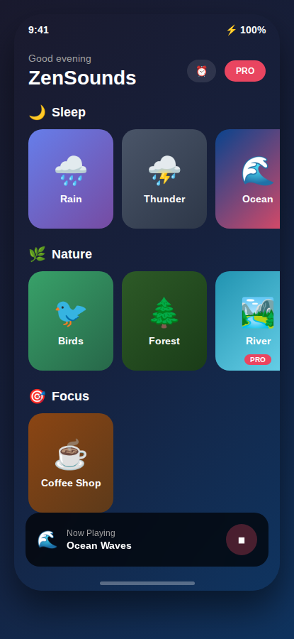
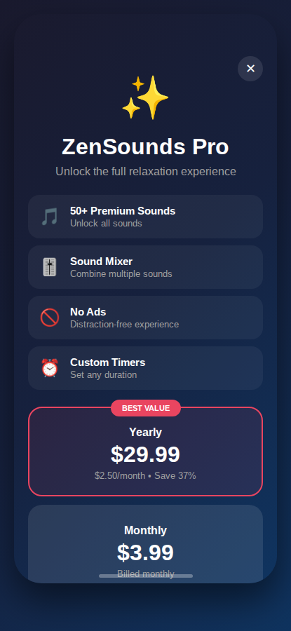

# 🧘 ZenSounds

**White noise & ambient sounds for better sleep, relaxation, and focus.**

[](LICENSE)
[](#)
[](https://expo.dev)
[](#contributing)

---

## 📱 Screenshots

<p align="center">
  
  &nbsp;&nbsp;&nbsp;&nbsp;
  
</p>

---

## ✨ Features

| Feature | Description |
|---------|-------------|
| 🌙 **Sleep Sounds** | Rain, ocean waves, thunderstorm, white noise |
| 🌿 **Nature Sounds** | Birds, forest, river, and more |
| ☕ **Focus Mode** | Coffee shop ambiance for productivity |
| 🎚️ **Sound Mixer** | Blend multiple sounds with custom volumes |
| ⏰ **Sleep Timer** | Auto-stop after 15/30/60/90 minutes |
| 🌙 **Dark Mode** | Easy on the eyes at night |
| 📱 **Background Play** | Keeps playing when you close the app |
| 💾 **Offline Mode** | All sounds work without internet |

---

## 💎 Premium

Unlock the full relaxation experience with **ZenSounds Pro**:

- **50+ Premium Sounds** - Access the complete sound library
- **Sound Mixer** - Combine multiple sounds together
- **No Ads** - Distraction-free experience
- **Custom Timers** - Set any duration you want
- **Widget Support** - Quick controls from home screen

**Pricing:** $3.99/month or $29.99/year (save 37%)

---

## 🛠️ Tech Stack

| Category | Technology |
|----------|------------|
| Framework | React Native + Expo |
| Audio | expo-av |
| State | Zustand |
| UI | React Native Reanimated |
| Monetization | RevenueCat |
| Ads | Google AdMob |
| Analytics | Mixpanel |

---

## 🚀 Getting Started

```bash
# Install dependencies
npm install

# Start Expo
npx expo start

# Run on iOS
npx expo run:ios

# Run on Android
npx expo run:android
```

---

## 📁 Project Structure

```
src/
├── app/           # Expo Router screens
├── components/    # Reusable UI components
├── hooks/         # Custom React hooks
├── stores/        # Zustand state stores
├── utils/         # Helper functions
├── constants/     # App constants & config
└── assets/        # Sounds, images, fonts
```

---

## 🤝 Contributing

Contributions are welcome! Feel free to open an issue or submit a PR.

---

## 📄 License

MIT © [bendudebot](https://github.com/bendudebot)
